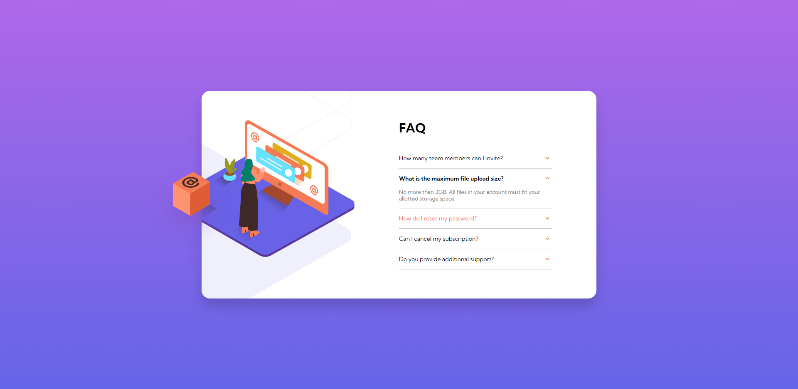

# Frontend Mentor : Faq-Accordion-Card

⭐완성된 Challenges : https://yuuujin97.github.io/Faq-Accordion-Card/

---

## [Frontend Mentor](https://www.frontendmentor.io) Challenges란

주어진 style-guide를 통해 design 폴더에 있는 설계와 최대한 비슷하게 만드는 것입니다.

design 폴더 안에는 mobile 버전과 desktop 버전의 디자인이 있고,
style-guide 문서에는 색상표, 글꼴 등 필요한 정보가 담겨있습니다.
font size, padding , margin 등은 스타일에 맞게 정의 해야합니다.

---

### 구현된 기능

- 반응형 웹 디자인 추가
- FAQ 리스트에 마우스 hover 상태 추가
- 질문 클릭 시 질문에 대한 답변 숨기기/표시하기

### Built with

- Semantic HTML5 markup
- CSS custom properties
- JavaSctipt
- Flexbox

### Screenshot

Desktop ver.

Active - Desktop.ver

Mobile ver.

Active - Mobile.ver

